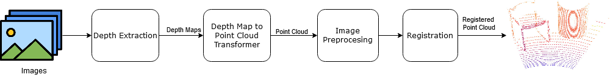
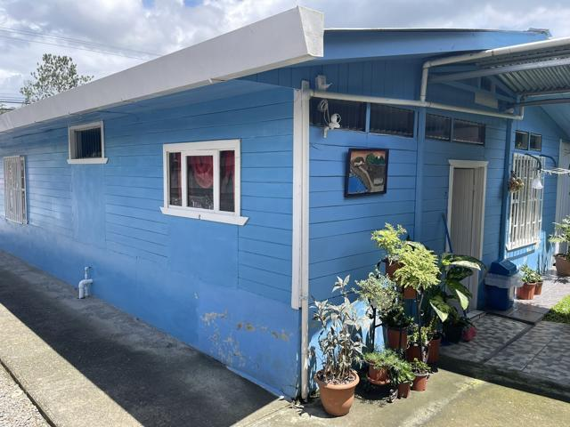
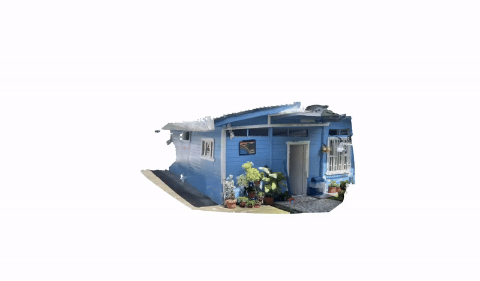
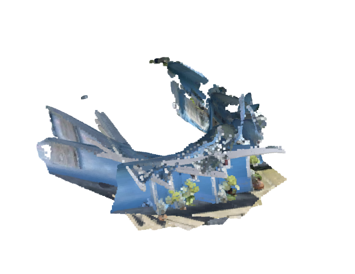

# Modelacion3DEntornos

3D Modeling Project from Digital Images

## Pipeline

 - ### Image Preprocessing
    - Resize image (640x480)
 - ### Extract Depth Map
    - Using the DepthAnything v2 model
    - Save depth map as a `.npy` file
 - ### Generate Point Cloud:
    - Using the depth matrix
    - Original image colors
    - Generic intrinsics
    - Generate the point cloud
 - ### Postprocessing
    - Remove outliers
    - Save as a `.ply` file
 - ### Registration Preprocessing
    - Downsampling with voxels
    - Normal estimation
 - ### Registration: Global Registration using Fast Point Feature Histograms (FPFH) 
 - ### Registration: Colored Iterative Closest Point (ICP)

## Data
The data can be uploaded to the folder Data/input/<<dataset name>>/*.png.
The modeling results will be saved in Data/output/<<dataset name>>/, including the depth map in .npy format and the point cloud in .ply format.

## Results

Point cloud generation has also been successful, as proportions have been preserved and distortion is minimal.

The system functions correctly up to the registration stage, where issues arise. It is capable of representing the environment based on an image, enabling the creation of a 3D representation from digital images. However, it is not possible to combine different representations into a single model

Although the registration process itself works correctly, its iterative execution causes a small deformation in the data to negatively impact subsequent registrations. This accumulation of errors further deteriorates the results of future registrations.

